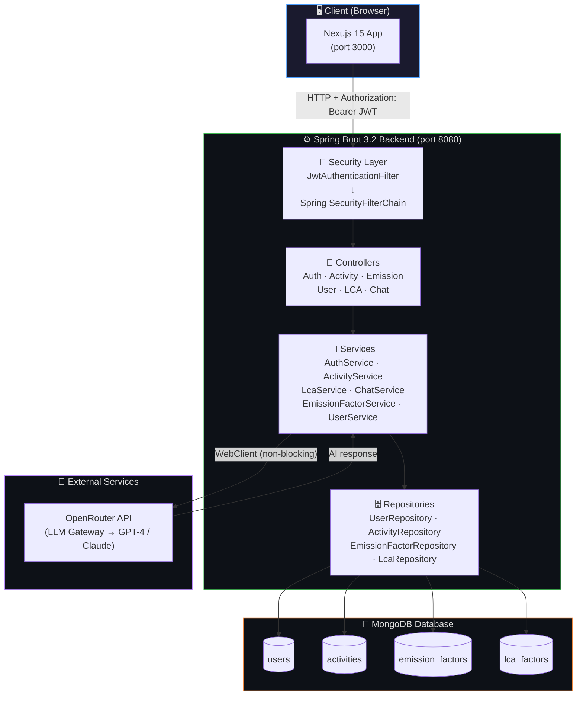
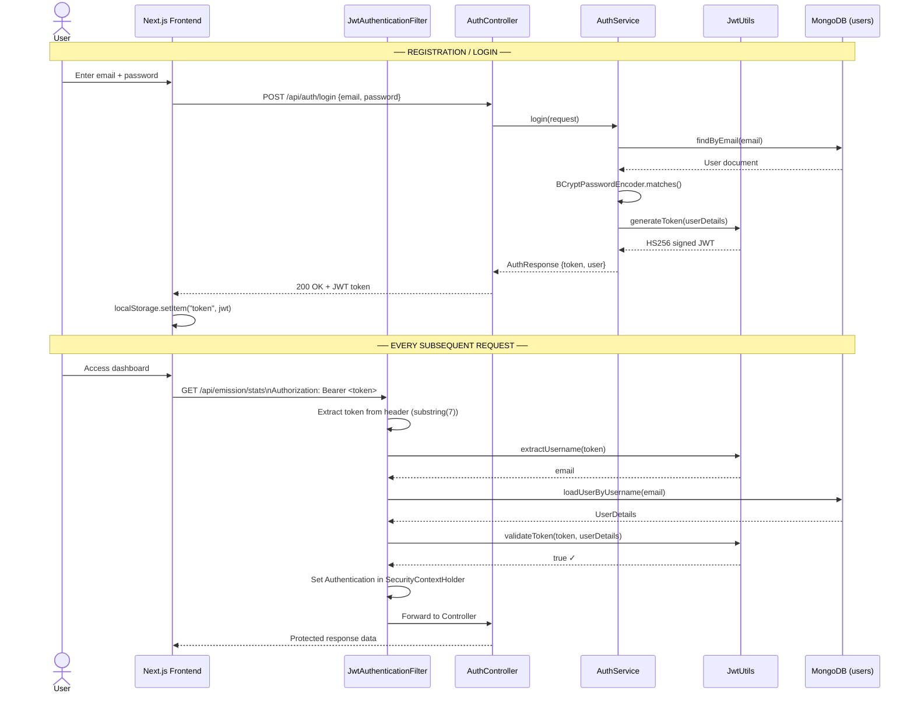
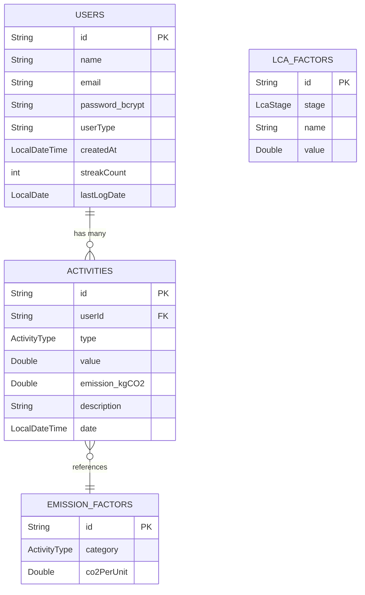
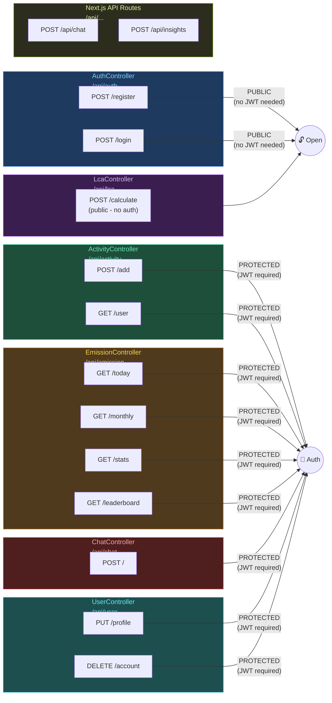
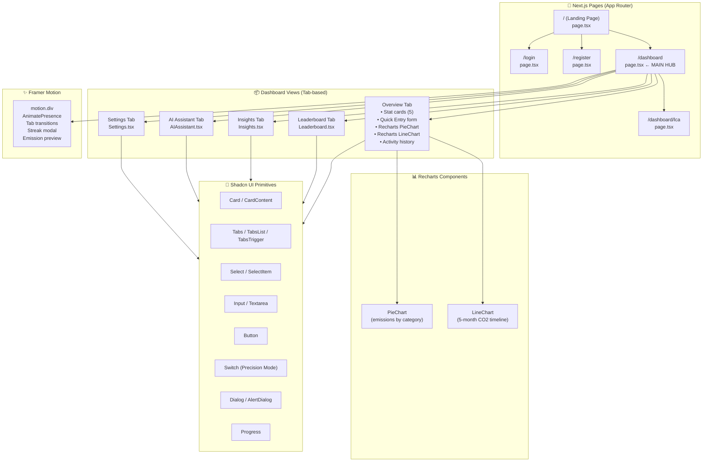
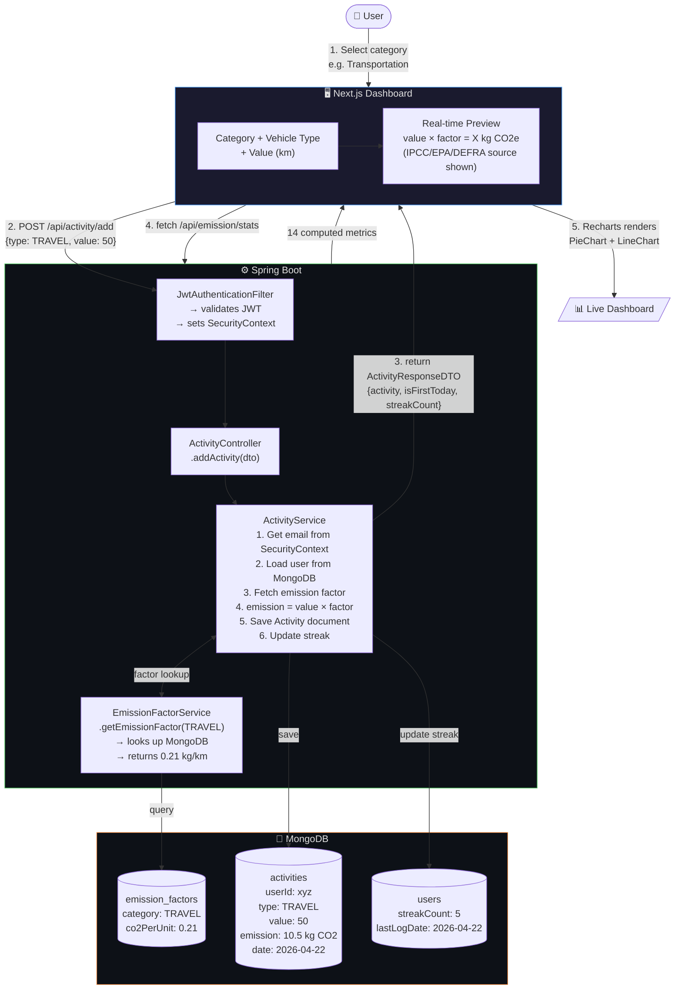
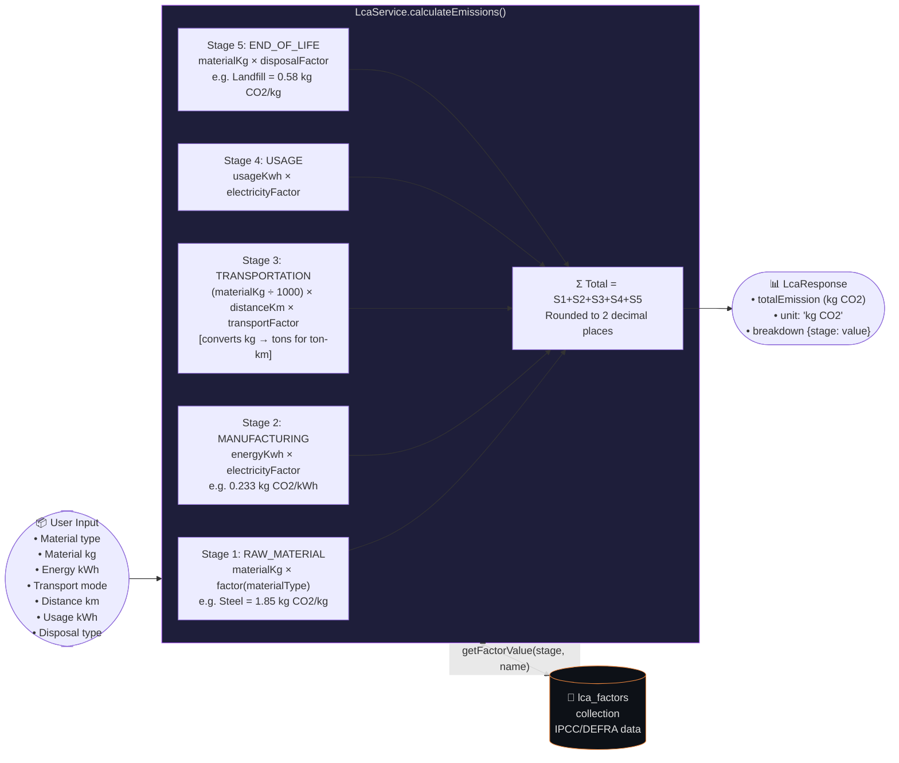
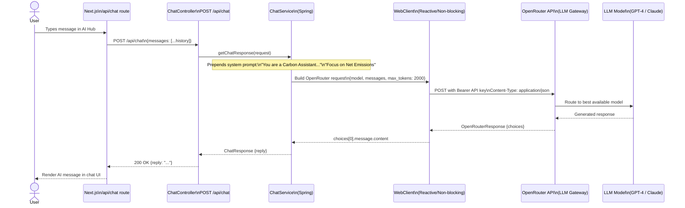
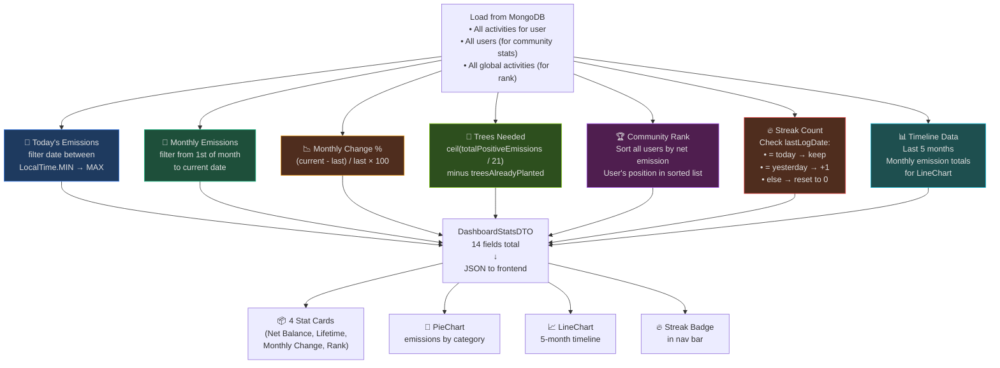
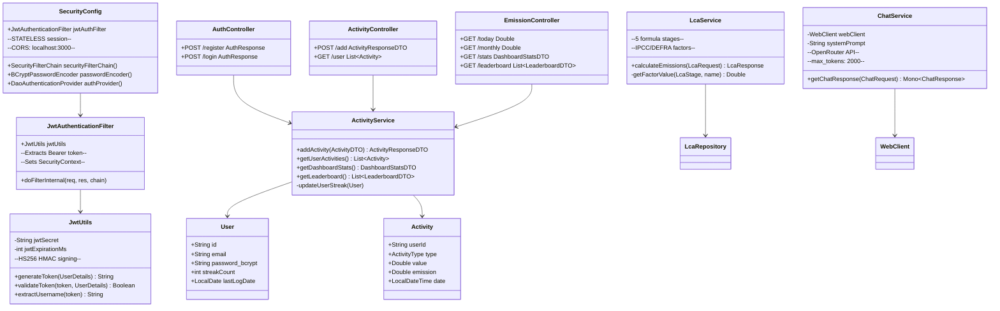

# 🌿 Carbon Tracker — Complete Design Diagrams

---

## 1. 🏗️ High-Level System Architecture

---

## 2. 🔐 JWT Authentication Flow

---

## 3. 🗄️ MongoDB Database Schema

**ActivityType enum (10 values):**
`TRAVEL · ELECTRICITY · FOOD · HEATING · FLIGHTS · PRODUCT · TREE_PLANTING · WASTE · WATER · SHOPPING`

**LcaStage enum (5 stages):**
`RAW_MATERIAL · MANUFACTURING · TRANSPORTATION · USAGE · END_OF_LIFE`

---

## 4. 📡 Complete REST API Map

---

## 5. 🖥️ Frontend Component Tree

---

## 6. 🔄 Emission Tracking Data Flow

---

## 7. 🌍 5-Stage LCA Calculation Engine

---

## 8. 🤖 AI Sustainability Hub Call Chain

---

## 9. 📊 Dashboard Stats Computation (getDashboardStats)

---

## 10. 🏛️ Backend Package Structure (Class Diagram)

---

> 💡 **How to use these diagrams in an interview:**
> - Diagram 1 → "Let me show you the bird's-eye view"
> - Diagram 2 → If asked "How does login work?"
> - Diagram 6 → If asked "Walk me through what happens when I log an activity"
> - Diagram 7 → If asked "Explain the LCA feature"
> - Diagram 9 → If asked "How do you compute dashboard metrics?"
